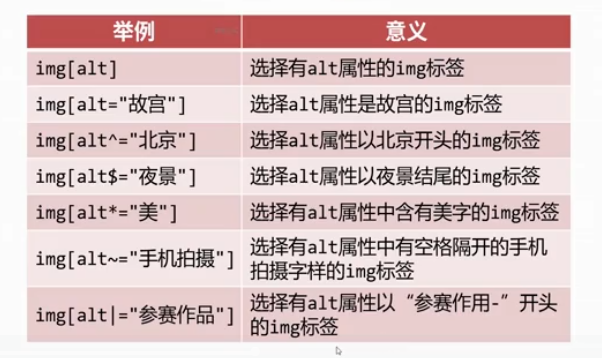
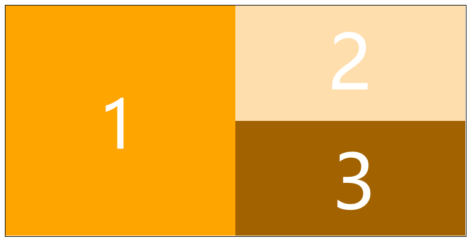
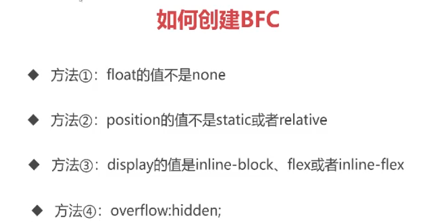
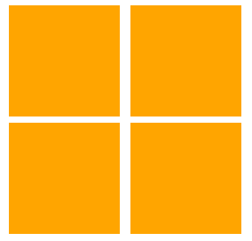
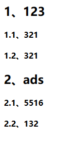

## CSS3(Cascading  Style  Sheet)笔记及问题

- ### 笔记

  - **引入css**

    - 内嵌式：`<style type="text/css"></style>`

    - 外链式：`<link rel="stylesheet" href="css/文件名.css">`

    - 行内式：直接在标签中书写`style="color: red;"`l

    - 导入式：`<style>  @import url(css/文件名.css);  </style>`<u>(几乎不用,因为使用这个样式时，网页不会等待css加载完毕，而是直接显示html结构后再渲染，使得网页有几秒素面朝天)</u>

      

  - **原子类**

    - 可以将常用的样式提前定义在css样式中，书写html标签时直接通过class类引用就可

      

  - **复合选择器**

    - 后代选择器：空格表示后代 (eg：`.box p {}` 表示类名为box的标签**后代**的p标签)

    - 交集选择器：(eg：`p.box {}` 表示类名为box的p标签)

    - 并集选择器：逗号表示并集 (eg：`.box,p {}` 表示类名为box的标签或者p标签)

      

  - **伪类**

    - 添加到选择器的描述性词语，指定要选择元素的特殊状态
      - `a:link`：没有被访问
      
      - `a:visited`：已被访问过
      
      - `a:hover`：正被鼠标悬停
      
      - `a:active`：已经按下，但还未松开
      
      - **必须按照上述四个顺序书写伪类，否则会造成伪类不生效（LVHA）**
      
        

  - **元素关系选择器**

    - 子选择器 `div>p`：div的子标签

    - **相邻**兄弟选择器`img+p`：图片后面紧跟着的段落将被选中

    - **通用**兄弟选择器`p~span`：p标签后的所有同层级span元素将被选中

      

  - **序号选择器**

    - `:first-child`：第1个子元素
    
    - `:last-child`：最后1个子元素
      
    - `:nth-child(3)`：第3个子元素
    
      - 括号中数字可以写作  `an+b` 的形式，<u>表示从b开始每a个选一个</u>
      - 也可以写 `odd` 和 `even`
    - `:nth-of-type(3)`：第3个某类型子元素
    - `:nth-last-child(3)`：倒数第3个子元素
    
    - `:nth-last-of-type(3)`：倒数第3个某类型子元素
      
    - **冒号前一定要加需要选择元素的标签**（eg：`div p:first-child {}` 表示选择div中的第一个p标签)
    
      
    
  - **前面有`nth`的后面一定会有`(n)`**
    
  - <u>兼容性：除 `:first-child` 兼容到 IE7以外，其余都兼容到IE9</u>
    
      
    
  - **属性选择器**

    - 
    
    - 从IE9开始兼容
    
      
    
  - **CSS3新增伪类**

    - `:empty`：选择空标签

    - `:focus`：选择当前获取焦点的表单元素

    - `:enabled`：选择当前有效的表单元素

    - `:disabled`：选择当前无效的表单元素

    - `:checked`：选择当前已勾选的**<u>单选按钮或复选框</u>**

    - `:root`：选择根元素，即 `<html>` 标签

      

  - **伪元素**

    - `::after` 和 `::before`

    - `::selection`

    - `first-line` 和 `first-letter`

      

  - **选择器权重**

    - id > class > 标签

    - 当有多个选择器，则比较数量

    - `!important` 书写在选择器内的某属性后，分号前

      

  - **设置字体**

    - `font-family: 字体1，字体2;` 

    - 引用其余字体库：可直接使用阿里巴巴官网上的字体库在线生成代码  <u>(但此种字体并不涵盖中文字体库中的所有文字)</u>

      

  - **文字属性**

    - **`text-indent` 属性**：首行文本内容之前的缩进量

    - **`line-height` 属性**：一般设置为倍数，设置行高 = 盒子高可以实现单行文本垂直居中

    - **`font` 合写属性**：`font-style`  `font-variant`  `font-weight`  `font-size`  `line-height`  和  `font-family` 的合写  ( `font-size/line-height`  一定要一起书写)，**属性间用空格隔开，且必须按照顺序书写**

      

  - **继承性**

    - 含有继承性：`color`，`font-` 开头，`list-` 开头，`text-` 开头，`line-` 开头

    - 在设置样式时，选择器权重失效，遵循就近原则

      ````html
      <!DOCTYPE html>
      <html lang="en">
      <head>
          <meta charset="UTF-8">
          <title>Document</title>
          <style type="text/css">
              /*例子1*/
              #box1 #box2 #box3 {
                  color: red;
              }
              p {
                  color: green;
              }/*此样式生效，p标签为绿色*/
              
              /*例子2*/
              #box1 #box2 {
                  color: red;
              }
              .box1 .box3 {
                  color: blue;
              }/*此样式生效，p标签为蓝色，box3离p更近*/
              /*特别地，如果离得一样近，则还是按权重比较*/
          </style>
      </head>
      <body>
          <div id="box1" class="box1">
              <div id="box2" class="box2">
                  <div id="box3" class="box3">
                      <p>我是一个p元素</p>
                  </div>
              </div>
          </div>
      </body>
      </html>
      ````

    
    
  - **`margin` 的塌陷**

    - <u>竖直方向</u>上 `margin` 不叠加，只取较大的margin

      

  - **`box-sizing` 属性**

    - `box-sizing: border-box` 设置后，盒子的  `width` 和 `height` 属性，就表示盒子实际的宽高，`padding` 和 `border` 变为内缩，不再外扩

      

  - **`display: none;` 和 `visibility: hidden;`**

    - `display: none;` ：彻底隐藏自己，消失同时放弃自己的位置

    - `visibility: hidden;`：消失，但是不放弃自己的位置

      

  - **浮动的顺序贴靠原则**

    - 子盒子会按顺序进行贴靠，2 靠 1，3 靠 2，但是若没有足够的空间，则会寻找再前一个的兄弟元素。即 若 3 靠 2没有空间，则 3 靠1，若 3 靠 1没有空间，才会去贴靠父元素 。

      ````html
      <!DOCTYPE html>
      <html lang="en">
      <head>
          <meta charset="UTF-8">
          <title>Document</title>
          <style type="text/css">
          .box {
              width: 600px;
              height: 300px;
              border: 1px solid #000;
          }
          .box1 {
              width: 300px;
              height: 300px;
              background-color: orange;
              float: left;
      
          }
          .box2 {
              width: 300px;
              height: 150px;
              background-color: navajowhite;
              float: left;
          }/* box1的width + box2的width 填满了整个 box的width*/
          .box3 {
              width: 300px;
              height: 150px;
              background-color: rgb(163, 98, 0);
              float: left;
          }/* box3的width溢出，无法贴靠box2，于是贴靠box1*/
          </style>
      </head>
      <body>
          <div class="box">
              <div class="box1"></div>
              <div class="box2"></div>
              <div class="box3"></div>
          </div>
      </body>
      </html>
      ````

      

    - 特别地，当元素浮动时，已经脱离文档流，则不具有元素本来的规定**<u>(例如：行内样式可以设置 `width` 和 `height` 等)</u>**

      

  - **解决高度塌陷**

    - 创建BFC (Block Fomatting Context)

    

    

    - **BFC约束规则**
    - 内部的Box会在垂直方向上一个接一个的放置
      - 垂直方向上的距离由margin决定。（完整的说法是：属于同一个BFC的两个相邻Box的margin会发生重叠（塌陷），与方向无关。）
    - 每个元素的左外边距与包含块的左边界相接触（从左向右），即使浮动元素也是如此。（这说明BFC中子元素不会超出他的包含块，而position为absolute的元素可以超出他的包含块边界）
      - BFC的区域不会与float的元素区域重叠
      - 计算BFC的高度时，浮动子元素也参与计算
      - BFC就是页面上的一个隔离的独立容器，容器里面的子元素不会影响到外面元素，反之亦然
  
    
  
    - **特别地**
  
      - BFC可以取消盒子margin的塌陷
  
        ````HTML
        <!DOCTYPE html>
        <html lang="en">
        <head>
            <meta charset="UTF-8">
            <title>Document</title>
            <style type="text/css">
                p {
                    width: 100px;
                    height: 100px;
                    background-color: orange;
                    margin: 50px auto;
                }/* 在没有设置div的overflow: hidden;时，两个p标签的距离为50px，外边距重叠 */
                div {
                    overflow: hidden;
                }/* 设置后外边距不重叠，距离为100px */
            </style>
        </head>
      <body>
            <div>
              <p class="p1"></p>
            </div>
          <div>
                <p class="p2"></p>
          </div>
        </body>
      </html>
        ````
  
        
  
      - BFC可以阻止元素被浮动元素覆盖
  
        
  
  - **清除浮动**
  
    ````html
    <!DOCTYPE html>
    <html lang="en">
    <head>
        <meta charset="UTF-8">
        <title>Document</title>
        <style type="text/css">
            p {
                width: 100px;
                height: 100px;
                background-color: orange;
                float: left;
                margin-left: 10px;
                margin-top: 5px;
            }
    
        </style>
    </head>
    <body>
        <div>
          <p></p>
            <p></p>
      </div>
        <div>
          <p></p>
            <p></p>
      </div>
    </body>
    </html>
    ````

    此时因为没有生成BFC，效果图为：

    

    但是所需效果图为：

    

    

    为了解决 `<p>` 脱出父元素 `<div>` 排布问题，则有以下解决方法：

    1. 给父元素设置 `overflow: hidden;`

    2. 给后面的父元素设置 `clear: both`； ，表示清除别的元素对自身的影响 (但是此方法会导致 `margin` 失效，因此不推荐)
  
  3. 使用为元素  `::after` 给盒子添加最后一个子元素，并给 `::after` 设置 `clean:both` **(tips: `::after` 一定要转换为块元素)**
  
  4. 在两个 `div` 之间加一个 `div` 标签，并给添加的 `div` 标签加一个 `clean: both`，`margin` 也会失效，但是可以用添加的 `div` 设置自身的高度来使两个 `div` 分开
  
     
  
- **相对定位**
  
    - 在其他位置渲染，但是元素本身位置保留，不脱离文档流
    
    - 适合用于微调
  
- **绝对定位**
  
  - 设置了绝对定位的属性，会以最近的设置了相对定位的父元素作为参考点，称为”子绝父相“，若其父元素都未设置参考点，则该元素以浏览器的左上角作为参考点
  
  - 绝对定位的盒子设置垂直居中：
  
      ````Css
      position: absolute;
      top: 50%;
    margin-top: -自己高度的一半;
    ````
  
      水平居中也如上方法，因为元素脱离文档流之后，`margin: 0 auto;` 不再生效
  
  - **`z-index`  属性**
  
    - 如果元素都开绝对定位，则再后面的标签的标签会盖住前面的标签
    - 可以通过 `z-index` 标签调整遮盖
    - 常用于制作 “压盖”，“遮罩”的效果
  
  - **固定定位**
  
    - 以浏览器当前窗口作为参考
    - 常用于做返回顶部，楼层导航等按钮
  
  - **`box-shadow`**
    - `box-shadow: x偏移量 y偏移量 模糊程度 阴影延展 color;`
    - 内阴影：`box-shadow: `**`inset  `**`x偏移量 y偏移量 模糊程度 阴影延展 color;`
    - 可设置多阴影，只要在每个属性组后用逗号把组隔开即可
    
  - **`background` 有关属性**
  
    - **`background-image`**
      - `background-image: url();`
      - `background-image: linear-gradient(to right, blue, red);`
        - 线性渐变背景
        - 可以用角度表示（45deg）
        - 可以设置多个颜色，并用百分数表示其出现位置
      - `background-image: radial-gradient(圆心位置，blue, red);`
      - `background-repeat`
        - x，y轴都平铺：`repeat` (默认)
        - x轴平铺：`repeat-x`
        - y轴平铺：`repeat-y`
        - 不平铺：`np-repeat`
    - **`background-size`**
      - `background-size: width height` (兼容到IE9)
      - `width` 和 `height` 的值可以设置为 auto 或者 百分数，若设置为百分数，意为父元素的百分之几
      - `contain` :  将背景图智能改变尺寸以容纳盒子
      - `cover` :  将背景图智能改变尺寸以撑满盒子
    - `background-clip`(背景裁切)
      - `border-box`：默认值，背景图延伸至边框
      - `padding-box`：背景图延申至内边距处，含内边距不含边框，仅在 `border-style`为`dashed` 和 `dotted` 时可察觉
      - `content-box`：背景图延申至内容区，不包含 `border` 和 `padding`
    - `background-origin`(背景起源)，属性值同上
    - **`background-attachment` **(背景固定)
      - `fixed`：自己滚动条不动，外部滚动条不动
      - `local`：自己滚动条动，外部滚动条也动
      - `scroll`：自己滚动条不动，外部滚动条动 (默认值)
    - **`background-position`** (背景图定位，用于雪碧图)
  
  - **浏览器私有前缀** (用来对实验性质的CSS属性加以标识)
  
    - Chrome：-webkit-
    - Firefox：-moz-
    - IE，Edeg：-ms-
    - 欧朋：-o-
    
  - **`transform`**
  
      - `transform: rotate(45deg)`：旋转变形
      - `transform-origin`：设置绕哪个点进行旋转
      - `transform: scale(倍数)`：缩放变形
      - `transform: skew(50deg,45deg)`：斜切变形，括号内是代表x方向的变形和y方向的变形
      - `transform: translate(100px, 200px)`：与相对定位相似，不脱离文档流 (只兼容到IE9)
      - `transform: rotateX(度数) rotateY(度数) rotateZ(度数)`
          - **注意想让3D旋转生效生效必须设置 `prespective` 属性，该属性的值为一个任意的px值**
          - `prespective` 属性一定是设置给设置 `transform` 属性的元素的**父元素**
      - `transform: translateX(度数) translateY(度数) translateZ(度数);`
          - **一定是在设置了`rotate x y z`后，设置`translate x y z`才能显示效果**
      
  - **`transition`** 
  
      - `transition: width 1s linear 0s;`
      - `transition: 需要过度的属性 动画时长 变化速度曲线 延迟时间；`
      - 尽可以过渡以属性值为数值的属性
      - `transition` 的小属性
          - `transition-property`：需要过渡的属性
          - `transition-duration`：动画时间
          - `transition-timing-function`：动画变化曲线
              - `linear`：匀速
              - `ease`：默认值，中段加速，结尾减速+
              - `ease-in`：先慢后快
              - `ease-out`：先快后慢
              - `ease-in-out`：先慢后快再慢
              - `cubic-bezier(.29, 1.01, 1, -0.68)`：bezier曲线，在 http://cubic-bezier.com/ 生成
              - `steps( n, <jumpterm>)`：分部
          - `transition-delay`：延迟时间
      - **`animation`**
          - `@keyframes 动画名称`{} 关键帧
              - 开始形态到结束形态：from{} to{}
              - 多关键帧：用百分数表示
          - 语法格式: `animatiom: r 1s linear 0s 3` (5个值分别为 动画名称  执行时间  执行类型  延迟时间  执行次数)
          - 如果想永远执行，执行次数可写infinite
          - 第六个参数：
              - `alternate`：偶数次自动逆向执行
              - `forwards`：停止在最后结束状态


- ### 问题

  - **序号选择器**

    - **`nth-child` 和 `nth-of-type` 区别**

      ````html
      <!DOCTYPE html>
      <html lang="en">
      <head>
          <meta charset="UTF-8">
          <title>Document</title>
          <style type="text/css">
              div p:nth-child(3){
                  color: red;
              }/*样式不生效，因为div的child(3)是h2标签，而选择器又想选择p标签若想选择3号p标签，应该使用nth-of-type(3)的选择器*/
              div p:nth-of-type(3){
                  font-size: 18px;
              }
          </style>
      </head>
      <body>
      	<div>
              <p>我是1号p标签</p>
              <p>我是2号p标签</p>
              <h2>我是1号h2标签</h2>
              <h2>我是1号h2标签</h2>
              <p>我是3号p标签</p>
              <p>我是4号p标签</p>
              <p>我是5号p标签</p>
          </div>
      </body>
      </html>
      ````

      

    - **`li:first-child` 选择任意标签中的第一个 `li` 标签**

      ````html
      <!DOCTYPE html>
      <html lang="en">
      <head>
          <meta charset="UTF-8">
          <title>Document</title>
          <style type="text/css">
              li:first-child {
                  color: red;
              }/*样式只设置给“家用电器的列表项”和清洁用品中的”洗衣液“
          </style>
      </head>
      <body>
          <ul>
              <li>
                  家用电器
                  <ol>
                      <li>冰箱</li>
                      <li>洗衣机</li>
                      <li>空调</li>
                  </ol>
              </li>
              <li>
                  清洁用品
                  <ol>
                      <li>洗衣液</li>
                      <li>消毒液</li>
                      <li>洗厕液</li>
                  </ol>
              </li>
              <li>妇婴用品</li>
          </ul>
      </body>
      </html>
      ````

      

  - **属性选择器 (`[class^=s]`)**

    ````html
    <!DOCTYPE html>
    <html lang="en">
    <head>
        <meta charset="UTF-8">
        <title>Document</title>
        <style type="text/css">
            div[class^=s]{
                color: red;
            }
        </style>
    </head>
    <body>
        <div class="one s">one</div>
        <div class="one s stwo">one</div>
        <div class="one sthree">one</div>
        <div class="sone sfour">one</div>
        <div class="sone">one</div>
    </body>
    </html>
    ````

    - 上述代码中`one`  `two`  `three` 将不会被选中 因为该选择器检测的是**class的第一个字母是否为 `s` **，若不是，即使后面的class名满足 `s` 开头，也无法设置样式，`[class$=s]` 同理。

      

  - **元素优先级**

    - `!important` 的优先级大于标签中设置的样式
    
      
    
  - **`font` 合写属性**

    - 前三个属性可以任意调换位置，但后两个不可以
    
    - `font-size` 和 `font-family` 为必写属性
    
    
    
  - **CSS通过hover一个标签，实现另一个标签的响应 (CSS伪元素和元素关系选择器结合)**

    ````html
    <!DOCTYPE html>
    <html lang="en">
    <head>
        <meta charset="UTF-8">
        <title>Document</title>
        <style type="text/css">
            a {
                text-decoration: none;
            }
            .length div {
                background-image: url('');
                width: 100px;
                height: 100px;
                display: none;
                border: 2px solid red;
                background-repeat: no-repeat;
            }
            /*当鼠标移动到类名为length的div上时，其后代div元素响应，样式改变*/
            .length:hover div{
                display: block;
                background-size: 100px 100px;
            }
        </style>
    </head>
    <body>
        <h2>background-size不同属性值不同效果</h2>
        <div class="length">
            <h3><a href="">100px 100px</a></h3>
            <div></div>
        </div>
    </body>
    </html>
    ````

  

  - **`background-position`属性值问题**
    
    - 若只规定了一个关键词，则第二个关键词默认为center
    
      
    
  - CSS父元素选择器
    
    
    
  - **`background-image` 设置多个背景图**
    
    - 设置多个层叠背景
    
    
    
    ​	ps：想让哪个层级显示在上面，就把该图的url写在靠前
    
    
    
    - 设置多个有位置排布置的背景
    
      
    
      ````html
      <!DOCTYPE html>
      <html lang="en">
      <head>
          <meta charset="UTF-8">
          <title>Document</title>
          <style type="text/css">
              div {
                  width: 700px;
                  height: 800px;
                  margin: 50px auto;
                  background: center 0/700px 210px  no-repeat 		url('http://climg.mukewang.com/582c34220001091605000150.jpg'), center 240px no-repeat url('http://climg.mukewang.com/582c342b0001fd6507000210.jpg');
              }
          </style>
      </head>
      <body>
          <div class="bg-box"></div>
      </body>
      </html>
      ````

  - **物理像素、逻辑像素和移动端1像素边框**

    - 物理像素：也称硬件像素，也就是说手机屏幕实际拥有的像素点，如：iPhone 6屏幕宽度750个像素点，高度1334个像素点

    - 逻辑像素：也称设备独立像素，即在css/js代码中使用的像素

    - 设备像素比 (DPR)：设备的 **物理像素** 与 **逻辑像素** 比

      

  - **`li::marker`**

    - 可以用来设置列表前的 `list-style` 的属性
      
    - 注释：`list-style` 又分为 `list-style-type` 、`list-style-position` 和 `list-style-image`
      
    - 值得注意的是：目前只有以下属性能够作用于`marker`伪元素上

      1. 所有的字体样式：`font`相关

      2. `white-space`属性

      3. `color`属性

      4. `text-combine-upright`, `unicode-bidi`, `direction`属性

      5. `content`属性

      6. 所有的`animation`和`transition`属性

         

  - **`counter-increment`** 和 **`counter-reset`**

    - `counter-increment`：这个属性代表递增一个或多个计数器的值；其默认值为none；其属性值有 none ，id number ，inherit三个属性值

      - `none`：代表没有计数器递增。
      - `id number`：id 定义将增加计数的选择器、id 或 class。number 定义增量。number 可以是正数、零或者负数。
      - `inherit`：继承父类的属性值。
      - *counter-increment属性通常用于counter-reset属性和content属性。*

    - `counter-reset`：counter-reset属性创建或重置一个或多个计数器。 其默认值为none；其属性值有 none ，id number ，inherit三个属性值。

      - `none`：不能对选择器的计数器进行重置）

      - `id number`：id 定义将重置计数的选择器、id 或 class。number 。可以设置选择器出现个数number 可以是正数、零或者负数。

      - `inherit`： 继承父类的属性值。

        

    实例如下：

    ```html
    <html>
    	<head>
    		<meta charset="utf-8">
    		<title>计数器</title>
    		<style type="text/css">
    			/* 配合counter-increment和counter-reset属性 */
    			body{
    				counter-reset: section;/* 设置选择器出现的次数根据内容 */
    			}
    			h2{
    				counter-reset: subsection;
    			}
    			h2:before{
    				counter-increment:section;/*属性递增一个或者多个计数器的值*/
    				content:counter(section) "、";
    			}
    			h4:before{
    				counter-increment:subsection;
    				content: counter(section) "." counter(subsection) "、";
    			}
    		</style>
    	</head>
    	<body>
    		<h2>123</h2>
    		<h4>321</h4>
    		<h4>321</h4>
    		<h2>ads</h2>
    		<h4>5516</h4>
    		<h4>132</h4>
    	</body>
    </html>
    ```

    其运行结果如下：

    

    **由此可知：上述就是这个属性的作用，主要用来排序而不用有序列表ul来进行排序；**

  

  - **min-width**：给页面设置最小宽度
  - **水平居中**
    1. 行内元素可以通过父元素设置的 `text-align: center` 水平居中；
    2. 块元素可以通过设置 `width 和 margin: 0 auto` 来设置