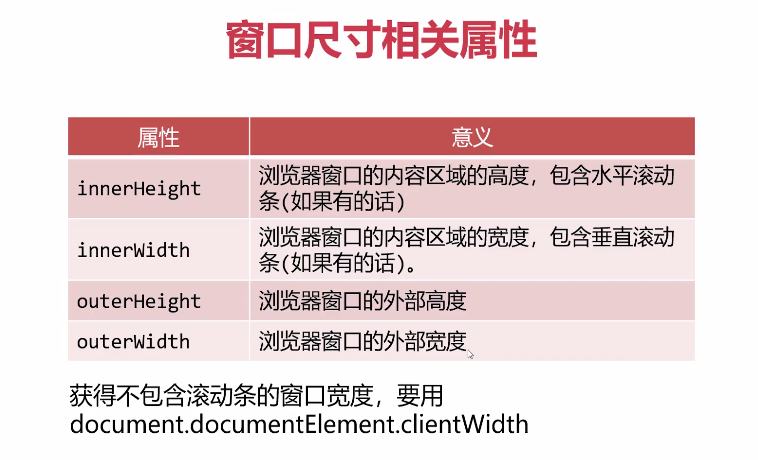
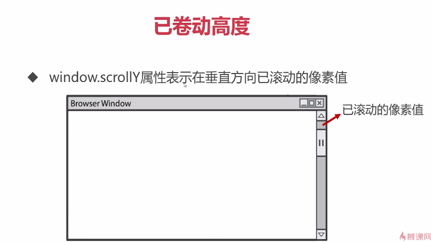
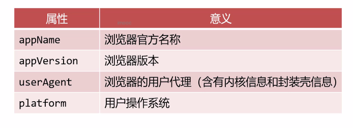

## BOM

>Browser Object Model，浏览器对象模型
>
>是JavaScript与浏览器窗口交互的接口


- #### window 对象

  是当前 JS 脚本运行所处的窗口，而这个窗口中包含的 DOM 结构，`window.document` 属性就是 `document` 对象;

  在有标签页功能的浏览器中，每个标签都拥有自己的 window 对象，即同一个窗口的标签页之间不会共享一个 window 对象；

  

  - 全局变量是 `window` 对象的属性，内置函数是 `window` 对象的方法

    ````js
    var a = 10;
    console.log(window.a == a);		// true
    console.log(window.alert == alert);		// true
    ````

    由此可知，**多个JS文件之间是共享全局作用域的**；

    此外还可以使用 `window` 对象查询是否存在可能未声明的变量

    ````js
var newValue = oldValue;		// 报错：oldValue is undefined;
    var newValue = window.oldValue		// 不会抛出错误，因为是属性查询
    // 此时newValue会被设置为undefined
    ````
    
    
    
  - `onresize` 事件：监听窗口尺寸改变
  
    ````js
    window.onresize = function () {
        var root = document.documentElement;
        console.log('窗口尺寸：' + root.clientWidth, root.clientHeight);
    }
    ````
  
    在日常工作中，为了兼容性常常将获取网页高度写做：
  
    ````js
    var scrollTop = window.scrollY || document.documentElement.scrollTop
    ````
  
    特别的，`document.documentElement.scrollTop` 不是只读的，而 `window.scrollY` 是只读的；
  
  - `onscroll` 事件：窗口被卷动就触发
  
    ````js
    window.onsrcoll = function () {
        console.log('窗口卷动了：' + window.scroll);
    }
    ````
  
    

- **Navigation 对象**

  `window.navigation` 属性可以检索 `navigator` 对象，它内部含有用户此次活动的**浏览器相关属性和标识**；

  

  ````js
  console.log('浏览器品牌：' + navigator.appName);
  console.log('浏览器版本：' + navigator.appVersion);
  console.log('浏览器用户代理：' + navigator.userAgent);
  console.log('用户操作系统：' + navigator.platform);
  ````

  

- **History 对象**

  window.history 对象提供了**操作浏览器会话历史**的接口

  最常用的操作就是模拟浏览器回退的按钮：

  ````js
  history.back();			// 等同于点击浏览器回退按钮
  history.go(-1);			// 同上
  ````

  以上两个页面移动端较为常用；

  

  关于使用 `history.go('url')`：

  ````js
  window.history.go('http://www.baidu.com')
  ````

  用以上语句给按钮绑定一个页面跳转事件，不成功；

  原因如下：

  >Syntax：history.go(vLocation)
  >
  >
  >
  > *Parameters:* 
  >
  >*vLocation Required. Variant that specifies an integer or a string. An integer indicates the relative position of a URL in the History list. A string indicates an exact URL in the History list.*

  大意为参数 `vLocation` 被要求类型为一个整数或者字符串，如果是整数则是代指着一个在 History List中一个相对位置的 URL，如果是一个字符串则指示着 **在 History List 中的确切的 URL**；

  

- **Location 对象**

  `window.location` 标识当前所在的网址，可以通过给这个属性**赋值命令浏览器进行页面跳转**

  ````js
  window.location = 'http://www.imooc.com';
  windoe.location.href = 'http://www.imooc.com';
  ````

  - `reload()` 方法：重新加载当前页面

    ````js
    window.location.reload(true); 	// 参数 true 表示强制从服务器加载
    ````

  - `search` 属性：为当前浏览器的GET请求查询参数

    例如有一个网址 `http://www.imooc.com/?a=1&b=2`

    ````js
    console.log(window.location.search);		// ?a=1&b=2
    ````

    在访问一个网站时，网址后可以用 `?` 来带一些参数给服务器的脚本程序，以上网址表示，我们向服务器传递了两个参数 `a = 1 & b = 2`，于是在本地，我们可以通过 `location.search` 来获取参数
    
    

  写一个用户登录页面，若账号密码输入正确，则跳转到百度：

  ````html
  <form action="" id="form">
      <label for="name">用户名：</label>
      <input type="text" id="name"><br>
      <label for="pwd">密码：</label>
      <input type="password" id="pwd"><br>
      <input type="submit" id="submit" >
  </form>
  ````

  ````js
  var oname = document.getElementById('name');
  var opwd = document.getElementById('pwd');
  // var obtnSub = document.getElementById('submit');
  var oform = document.getElementById('form');
  oform.onsubmit = function (e) {
      // 因以下条件语句无论什么情况都需要阻止默认事件，因此可以直接写在最前面
      e.preventDefault();
      if (oname.value != '张三' || opwd.value != '123456') {
          // 因为每次点击提交页面按钮时，页面会被刷新
          // 为了防止重新刷新资源，可以给页面设置阻止默认事件
          // e.preventDefault();
          alert('信息不对');
      } else {
          // 要阻止页面默认事件，否则页面刷新无法跳转
          // e.preventDefault();
          window.location = 'http://www.baidu.com';
      }
  ````

  因为 `submit` 提交表单时，默认事件就会刷新页面，从而**导致 `onsubmit` 中的语句执行之后会立刻被刷新覆盖，就产生类似没有执行过的效果**，因此我们需要在事件函数中设置 **`e.preventDefault()`** 语句，来阻止默认的刷新事件发生；

  

- **楼层导航效果**

  每个人DOM元素都有 `offsetTop`属性，表示此元素到**定位祖先元素** (在祖先中离自己最近的且拥有定位属性的元素) 的垂直距离；